# Live Verification Evidence - 2026-07-30

Screenshots captured during a live deployment and verification session against the real GKE
Autopilot cluster, documenting that the full order-processing chain actually ran end-to-end and
that its telemetry genuinely reached Google Cloud - not just "the code compiles" or "it worked
locally." Companion to `PLAN.md` (what was built) and `ISSUE.md` (the bugs found and fixed to get
here).

## The order workflow actually ran in Camunda

Real process instances, executed against the live cluster - including the debugging turn where a
real bug (the `Gateway_OrderValid` incident, see `ISSUE.md` #2 addendum 6) was caught live in the
UI and then fixed:

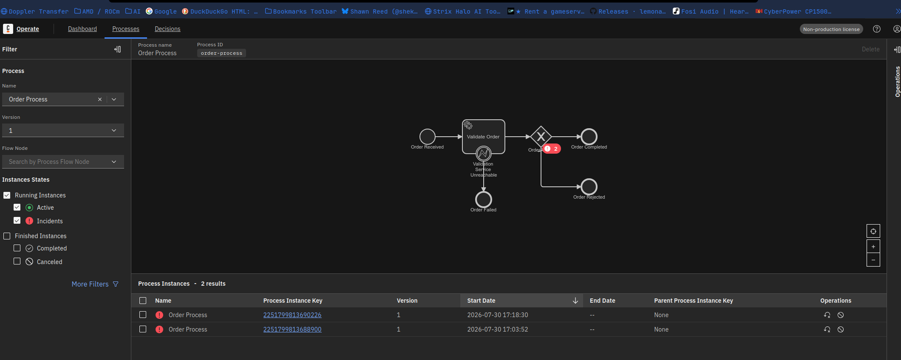

*Two instances with an active incident on the "Validation Service Unreachable" boundary event -
this screenshot is what led to finding and fixing the `Gateway_OrderValid` condition bug.*

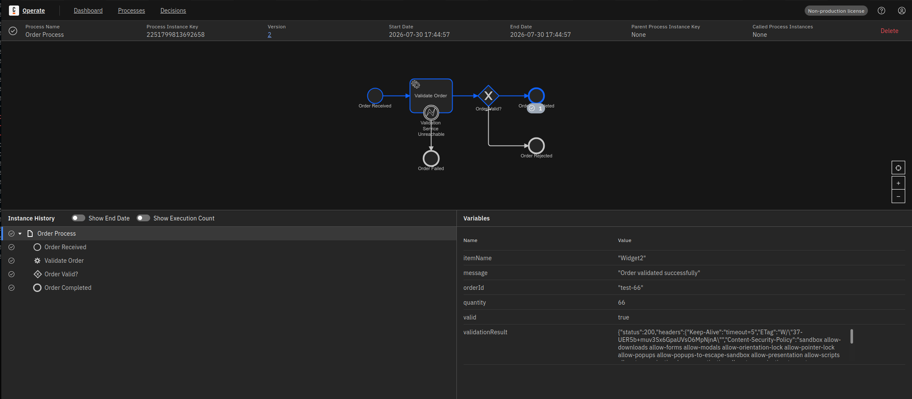

*After the fix: `Order Received -> Validate Order -> Order Valid? -> Order Completed`, all
highlighted, with `valid: true` and the n8n validation response visible in the Variables panel.
This was the user's own independently-triggered order (`orderId: test-66`), not mine.*

## Telemetry genuinely reaching Google Cloud

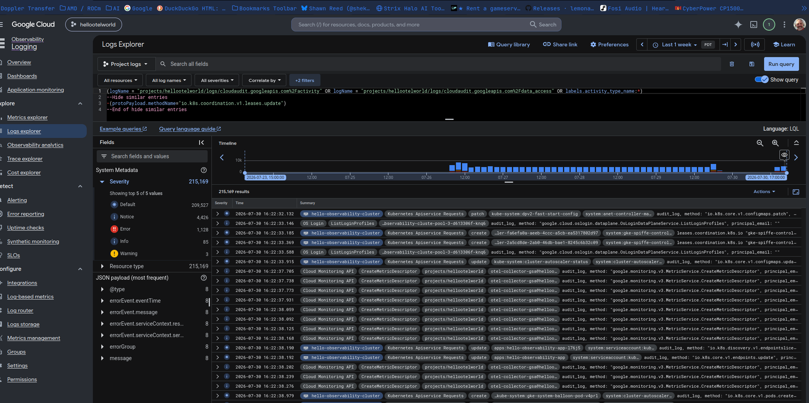

*Cloud Logging showing real, live activity from the running cluster - including
`CreateMetricDescriptor` calls from `otel-collector-gsa` succeeding against the Cloud Monitoring
API, confirming the OTel Collector's export pipeline was actually authenticated and working.*

## Finding the app's own business metrics in Cloud Monitoring

This took real troubleshooting - the metric existed but wasn't where it was expected, which is
its own useful record of how Cloud Monitoring's resource-type scoping actually behaves:

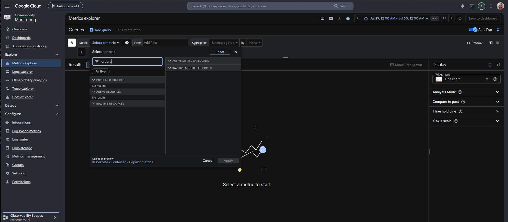

*Initial search for "orders" came back empty - the metric picker was scoped to the "Kubernetes
Container" resource category, and this metric (pushed via Micrometer's OTLP export rather than
detected via Kubernetes resource attributes) reports under "Generic Node" instead.*

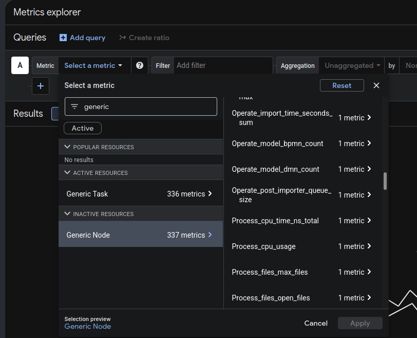

*Resetting the picker and browsing by resource category instead of searching by name surfaced it.*

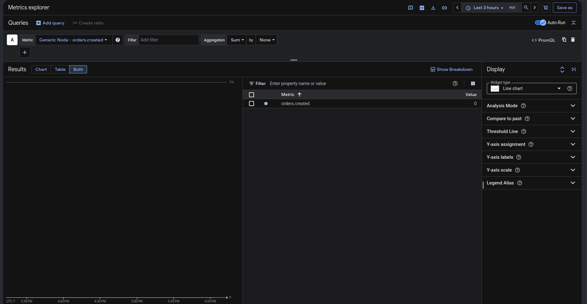

*`orders.created` found and confirmed as a real, queryable metric in Cloud Monitoring.*

## Watching real orders show up live

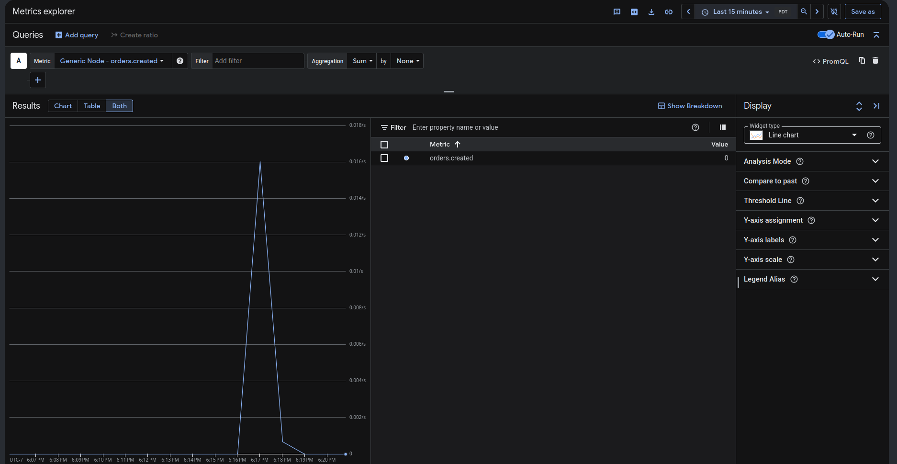

*One order submitted live, visible as a rate spike a few seconds later - the triangular shape
(rather than a flat plateau) is expected behavior for a cumulative counter sampled at a 60-second
push interval, not a bug.*

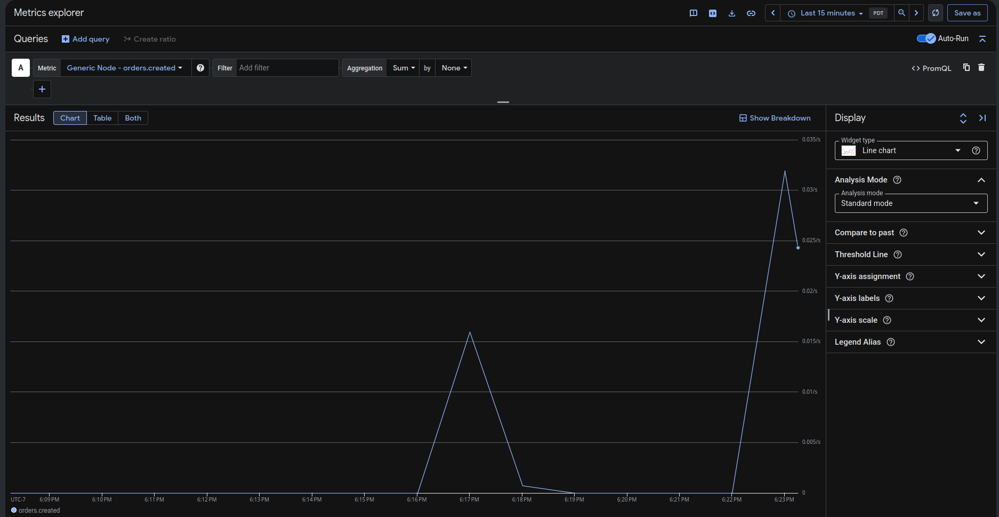

*A burst of 6 orders sent a few seconds apart, landing in the same push interval and producing a
proportionally larger spike.*

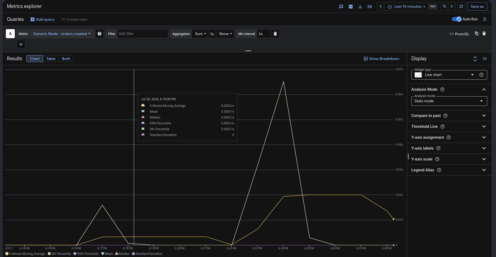

*Metrics Explorer's "Stats mode," showing a 5-minute moving average of the same data - a much more
dashboard-appropriate view of throughput than raw rate spikes, and a good starting point for the
`PLAN.md` Phase 7 golden-signals dashboard.*

## Real cloud costs and quotas along the way

Supporting evidence that this was a genuinely live, actively-billed GCP environment throughout -
not a simulation:

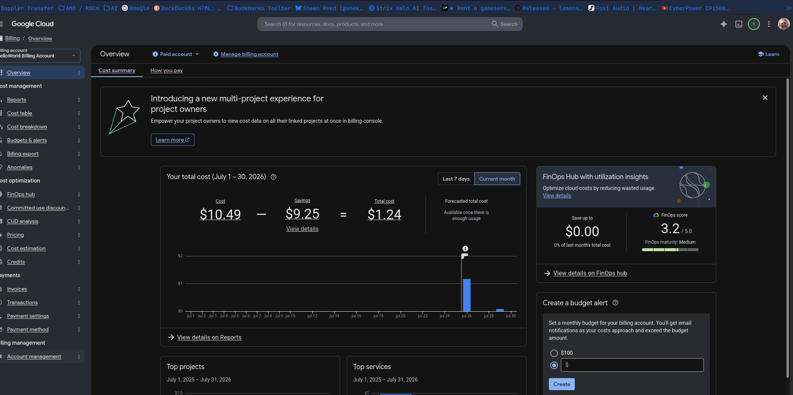

*Actual month-to-date cost. Confirms the infrastructure work in this session stayed cheap.*

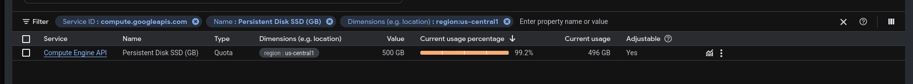

*A real, live operational finding during this session: the region's SSD persistent-disk quota was
nearly exhausted by the running cluster's node boot disks (GKE Autopilot node boot disks count
against this quota but aren't directly visible via `gcloud compute disks list`).*

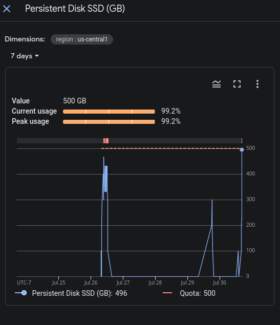

*Confirms the quota usage tracks whatever's actively running and genuinely clears after
`down.sh`/cluster teardown - not a slow leak.*

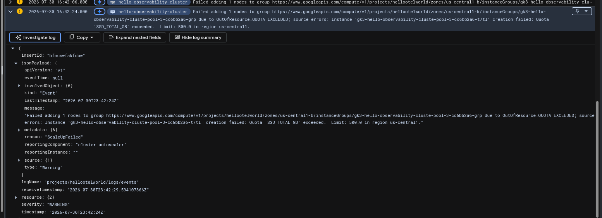

*The quota pressure wasn't just theoretical - the cluster autoscaler actually hit it and logged a
real `ScaleUpFailed` / `OutOfResource.QUOTA_EXCEEDED` event during this session (self-resolved,
no lasting impact - see the chat record for the full investigation).*
