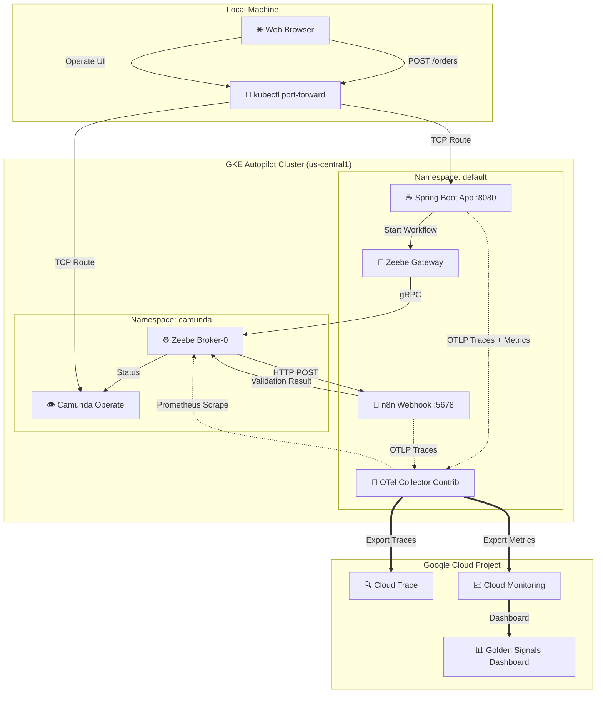

# Hello Observability: Pega to Composable Architecture PoC

This repository contains the Proof of Concept (PoC) for migrating from a monolithic
architecture (Pega) to a composable, cloud-native architecture using **Camunda 8**,
**n8n**, and **Spring Boot**, with unified observability via **OpenTelemetry (OTel)**.

## 🏗 Architecture

This deployment runs on **Google Kubernetes Engine (GKE) Autopilot**. It implements a
complete order processing workflow with distributed tracing and metrics pipeline to
Google Cloud Trace and Monitoring.



## 🎯 Golden Signals SLI/SLO

| Signal | SLI | SLO |
|---|---|---|
| **Latency** | 95th percentile end-to-end time | < 2s |
| **Throughput** | Orders processed/minute | > 10/min |
| **Errors** | Failed orders / total orders | < 1% |
| **Saturation** | Active workflow instances | < 100 concurrent |

## ⚡ Quick Start: Up/Down Scripts

The manual steps above are automated in `scripts/`, useful for spinning the PoC up before a demo
and tearing it down afterward so nothing keeps billing while it's idle:

```bash
./scripts/up.sh    # cert-manager -> OTel Operator -> OTel Collector -> n8n -> Camunda/Zeebe -> Spring Boot
./scripts/down.sh  # uninstalls all of the above and deletes Zeebe's PVC (the billed persistent disk)
```

Both are idempotent and safe to re-run. `down.sh` deliberately leaves the GKE Autopilot cluster
itself and the `otel-collector-gsa` IAM setup in place, since Autopilot has no idle cluster fee and
keeping them makes the next `up.sh` faster; pass `./scripts/down.sh --delete-cluster` if you want the
cluster gone too for absolute zero spend. `up.sh` also re-binds the OTel Collector's ServiceAccount
to Workload Identity on every run, since the OTel Operator regenerates that ServiceAccount whenever
its manifest is reapplied — see `ISSUE.md` #1 for why that matters.

## 🚀 Step-by-Step Deployment Guide

### Phase 1: Infrastructure & Observability Hub

1. Provision GKE Autopilot Cluster
```bash
gcloud services enable container.googleapis.com cloudtrace.googleapis.com logging.googleapis.com
gcloud container clusters create-auto hello-observability-cluster --region us-central1
gcloud container clusters get-credentials hello-observability-cluster --region us-central1
```

2. Install Cert-Manager (Autopilot Compatible)

SRE Note: We use Helm to install Cert-Manager and override the leader election namespace to bypass
GKE Autopilot's strict lockdown of the kube-system namespace.

```bash
helm repo add jetstack https://charts.jetstack.io
helm repo update

helm install cert-manager jetstack/cert-manager \
  --namespace cert-manager \
  --create-namespace \
  --version v1.14.4 \
  --set installCRDs=true \
  --set global.leaderElection.namespace=cert-manager
```

(Wait 60 seconds for Webhook certificates to properly inject into the API server).

3. Install OpenTelemetry Operator
```bash
kubectl apply -f https://github.com/open-telemetry/opentelemetry-operator/releases/latest/download/opentelemetry-operator.yaml
```

4. Deploy the OTel Collector

SRE Note: We use the Contrib image to gain access to the googlecloud exporter. Apply the
otel-collector.yaml from the k8s-infrastructure directory.

```bash
kubectl apply -f k8s-infrastructure/otel-collector.yaml
```

SRE Note: GKE Autopilot enforces Workload Identity. The Pod's Kubernetes ServiceAccount
(auto-created by the OTel Operator as `cluster-collector-collector`) must be bound to a
Google Service Account with `roles/monitoring.metricWriter` and `roles/cloudtrace.agent`,
or the `googlecloud` exporter will fail with `PermissionDenied`/`Unauthenticated` even if
the node's default compute service account already has those roles — an unbound KSA does
NOT inherit them. See the comment block at the top of `k8s-infrastructure/otel-collector.yaml`
for the exact `gcloud`/`kubectl` commands, and `ISSUE.md` #1 for the full writeup.

### Phase 2: Workload Deployment (n8n & Camunda 8)

1. Deploy n8n with OpenTelemetry Enabled

Apply the n8n.yaml deployment file. This natively routes execution traces to our in-cluster
OTel Collector.

```bash
kubectl apply -f k8s-infrastructure/n8n.yaml
```

To verify traces: Port-forward the service (`kubectl port-forward svc/n8n-service 5678:5678`),
trigger a manual workflow, and check GCP Cloud Trace.

2. Deploy Headless Camunda 8 (Zeebe)

SRE Note: We are deliberately deploying Camunda version 8.6.x (Helm chart 11.12.3) instead of
8.9 to bypass the new unified-image constraints and Elasticsearch max_map_count kernel panics
on Autopilot. We also bump the Gateway CPU to 500m to satisfy Autopilot's minimum anti-affinity
rules.

```bash
helm repo add camunda https://helm.camunda.io
helm repo update

helm install camunda-poc camunda/camunda-platform \
  --namespace camunda \
  --create-namespace \
  --version 11.12.3 \
  -f helm-values/camunda-values.yaml
```

(If Zeebe pods get stuck in CrashLoop or refuse to become Ready due to split-brain Raft state
from a previous deployment, wipe the state by deleting the PVCs: `kubectl delete pvc --all -n
camunda` and reinstall).

### Phase 3: Spring Boot App

Deploy the Spring Boot order service with OTel instrumentation:

```bash
kubectl apply -f k8s-infrastructure/hello-observability-app.yaml
```

The app exports custom business metrics (order latency, throughput, errors) via Micrometer/OTel
to Google Cloud Monitoring.

## 🔍 Verification

After deployment, verify everything is working:

1. **Check OTel Collector logs** for successful exports:
   ```bash
   kubectl logs -n default -l app.kubernetes.io/name=cluster-collector-collector --tail=50
   ```

2. **Test n8n webhook** (port-forward first):
   ```bash
   kubectl port-forward svc/n8n-service 5678:5678
   curl -X POST http://localhost:5678/webhook/order-validation \
     -H "Content-Type: application/json" \
     -d '{"orderId": "test-1", "itemName": "Widget", "quantity": 2}'
   ```

3. **Test Spring Boot app** (port-forward first):
   ```bash
   kubectl port-forward svc/hello-observability-app 8080:80
   curl -X POST http://localhost:8080/orders \
     -H "Content-Type: application/json" \
     -d '{"orderId": "test-1", "itemName": "Widget", "quantity": 2}'
   ```

4. **View traces** in Google Cloud Console:
   https://console.cloud.google.com/traces?project=hellootelworld

5. **View metrics** in Google Cloud Console:
   https://console.cloud.google.com/monitoring?project=hellootelworld

## 📋 Project Structure

```
.
├── k8s-infrastructure/           # Kubernetes manifests
│   ├── otel-collector.yaml       # OTel Collector CR
│   ├── n8n.yaml                  # n8n deployment
│   └── hello-observability-app.yaml  # Spring Boot deployment
├── spring-boot-app/              # Spring Boot order service
│   ├── src/                      # Java source code
│   ├── workflows/                # Camunda BPMN workflows
│   └── Dockerfile                # Container image
├── n8n/                          # n8n workflow definitions
├── helm-values/                  # Helm chart overrides
├── scripts/                      # Deployment scripts
│   ├── up.sh                     # Bring up all components
│   └── down.sh                   # Tear down all components
├── PLAN.md                       # Implementation plan & progress
└── ISSUE.md                      # Active issues & resolutions
```
