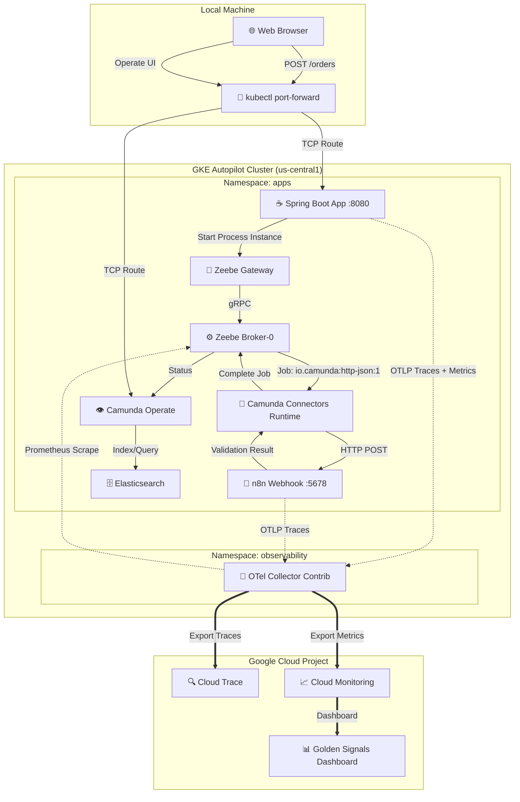

# Hello Observability: Pega to Composable Architecture PoC

Proof of concept for migrating from a monolithic architecture (Pega) to a composable,
cloud-native stack using **Camunda 8**, **n8n**, and **Spring Boot**, with unified observability
via **OpenTelemetry**.

**Status: working end-to-end.** `POST /orders` flows Spring Boot → Camunda 8 (BPMN workflow) →
n8n (validation webhook) → back to Camunda, with traces and metrics landing in Google Cloud Trace
and Monitoring - verified live against a real GKE cluster, not just locally. Getting here required
solving a handful of non-obvious platform/version issues along the way; see `ISSUE.md` for the
write-ups and `PLAN.md` for the phase-by-phase plan and what's still open (mainly: a Cloud
Monitoring dashboard, CI, and an eventual Camunda 8.10 upgrade).

## Architecture

Runs on **GKE Autopilot**.



The order workflow calls n8n via a Camunda Connector (`io.camunda:http-json:1`), Camunda's
built-in pattern for "call an HTTP endpoint, map the response" - not a hand-written job worker.
See `ISSUE.md` #2 for why.

## 🎯 Golden Signals SLI/SLO

| Signal | SLI | SLO |
|---|---|---|
| **Latency** | 95th percentile end-to-end time | < 2s |
| **Throughput** | Orders processed/minute | > 10/min |
| **Errors** | Failed orders / total orders | < 1% |
| **Saturation** | Active workflow instances | < 100 concurrent |

## ⚡ Quick Start

```bash
./scripts/up.sh    # brings up the full stack on the GKE Autopilot cluster
./scripts/down.sh  # tears it down so nothing keeps billing while idle
```

Both are idempotent and safe to re-run. A fresh bring-up (new cluster, cold image pulls) takes
roughly 10-15 minutes; re-running against an already-warm cluster is much faster. `down.sh` leaves
the cluster itself running by default - GKE Autopilot has no idle-cluster fee, and keeping it
makes the next `up.sh` faster - pass `--delete-cluster` for absolute zero spend.

## 🔍 Try It Out

```bash
# Spring Boot order API
kubectl port-forward svc/hello-observability-app 8080:80 -n apps
curl -X POST http://localhost:8080/orders \
  -H "Content-Type: application/json" \
  -d '{"orderId": "test-1", "itemName": "Widget", "quantity": 2}'

# Camunda Operate UI (demo/demo)
kubectl port-forward svc/camunda-poc-operate 8081:80 -n apps
# open http://localhost:8081
```

To watch an order run through the workflow: in Operate, go to **Processes** in the left nav,
select **order-process**, then click into a running or completed instance from the list. That
opens the BPMN diagram with the actual path the instance took highlighted live - trigger an order
with `curl` in one window and watch it light up the diagram in Operate in the other.

Then check [Cloud Trace](https://console.cloud.google.com/traces?project=hellootelworld) and
[Cloud Monitoring](https://console.cloud.google.com/monitoring?project=hellootelworld) for the
resulting telemetry.

## 📋 Project Structure

```
.
├── k8s-infrastructure/                  # Kubernetes manifests
│   ├── otel-collector.yaml              # OTel Collector CR
│   ├── n8n.yaml                         # n8n deployment
│   ├── hello-observability-app.yaml     # Spring Boot deployment
│   └── elasticsearch-computeclass.yaml  # GKE ComputeClass (Elasticsearch node sizing)
├── spring-boot-app/                     # Spring Boot order service
│   ├── src/                             # Java source code
│   └── src/main/resources/workflows/    # Camunda BPMN workflow
├── n8n/                                 # n8n workflow definitions
├── helm-values/                         # Helm chart overrides (Camunda)
├── scripts/
│   ├── up.sh                            # Bring up the full stack
│   ├── down.sh                          # Tear it down
│   └── n8n-import-workflow.js           # Imports/activates the n8n workflow (run via up.sh)
├── PLAN.md                              # Implementation plan & progress
└── ISSUE.md                             # Incident write-ups & root causes
```
