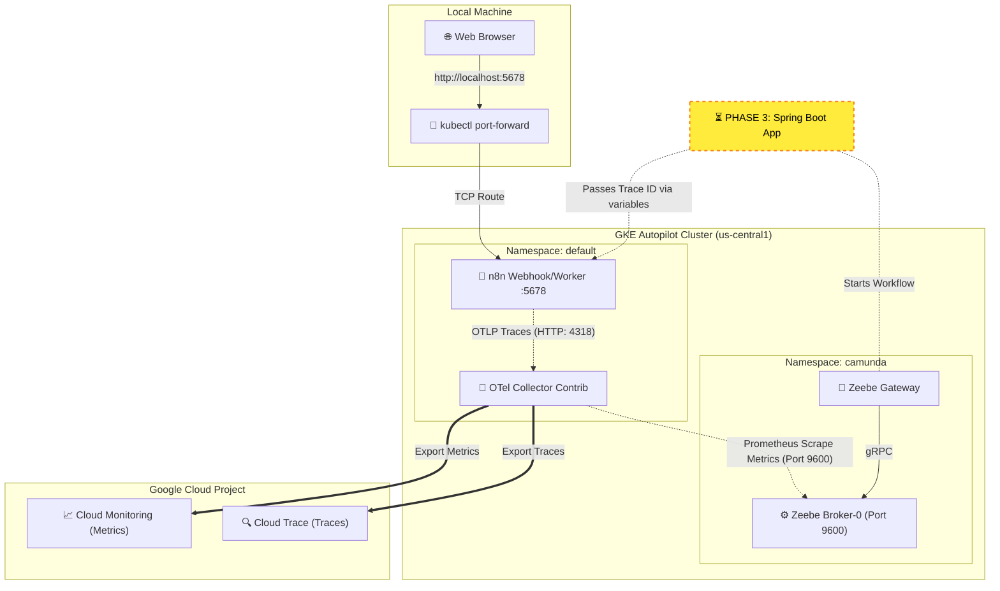

# Hello Observability: Pega to Composable Architecture PoC

This repository contains the Proof of Concept (PoC) for migrating from a monolithic architecture (Pega) to a composable, cloud-native architecture using **Camunda 8**, **n8n**, and **Spring Boot**, with unified observability via **OpenTelemetry (OTel)**.

## 🏗 Current Architecture (Phases 1 & 2)

This deployment runs on **Google Kubernetes Engine (GKE) Autopilot**. It implements a headless workflow engine and a distributed tracing pipeline to Google Cloud Trace.


🚀 Step-by-Step Deployment Guide
Phase 1: Infrastructure & Observability Hub

1. Provision GKE Autopilot Cluster
```bash
gcloud services enable container.googleapis.com cloudtrace.googleapis.com logging.googleapis.com
gcloud container clusters create-auto hello-observability-cluster --region us-central1
gcloud container clusters get-credentials hello-observability-cluster --region us-central1
```
2. Install Cert-Manager (Autopilot Compatible)
SRE Note: We use Helm to install Cert-Manager and override the leader election namespace to bypass GKE Autopilot's strict lockdown of the kube-system namespace.
```bash
helm repo add jetstack https://charts.jetstack.io
helm repo update

helm install cert-manager jetstack/cert-manager \
  --namespace cert-manager \
  --create-namespace \
  --version v1.14.4 \
  --set installCRDs=true \
  --set global.leaderElection.namespace=cert-manager
```
(Wait 60 seconds for Webhook certificates to properly inject into the API server).

3. Install OpenTelemetry Operator
```bash
kubectl apply -f https://github.com/open-telemetry/opentelemetry-operator/releases/latest/download/opentelemetry-operator.yaml
```
4. Deploy the OTel Collector
SRE Note: We use the Contrib image to gain access to the googlecloud exporter. Apply the otel-collector.yaml from the k8s-infrastructure directory.
```bash
kubectl apply -f k8s-infrastructure/otel-collector.yaml
```
SRE Note: GKE Autopilot enforces Workload Identity. The Pod's Kubernetes ServiceAccount
(auto-created by the OTel Operator as `cluster-collector-collector`) must be bound to a
Google Service Account with `roles/monitoring.metricWriter` and `roles/cloudtrace.agent`,
or the `googlecloud` exporter will fail with `PermissionDenied`/`Unauthenticated` even if
the node's default compute service account already has those roles — an unbound KSA does
NOT inherit them. See the comment block at the top of `k8s-infrastructure/otel-collector.yaml`
for the exact `gcloud`/`kubectl` commands, and `ISSUE.md` #1 for the full writeup.

Phase 2: Workload Deployment (n8n & Camunda 8)

1. Deploy n8n with OpenTelemetry Enabled
Apply the n8n.yaml deployment file. This natively routes execution traces to our in-cluster OTel Collector.
```bash
kubectl apply -f k8s-infrastructure/n8n.yaml
```
To verify traces: Port-forward the service (kubectl port-forward svc/n8n-service 5678:5678), trigger a manual workflow, and check GCP Cloud Trace.

2. Deploy Headless Camunda 8 (Zeebe)
SRE Note: We are deliberately deploying Camunda version 8.6.x (Helm chart 11.12.3) instead of 8.9 to bypass the new unified-image constraints and Elasticsearch max_map_count kernel panics on Autopilot. We also bump the Gateway CPU to 500m to satisfy Autopilot's minimum anti-affinity rules.
```bash
helm repo add camunda https://helm.camunda.io
helm repo update

helm install camunda-poc camunda/camunda-platform \
  --namespace camunda \
  --create-namespace \
  --version 11.12.3 \
  -f helm-values/camunda-values.yaml
```
(If Zeebe pods get stuck in a CrashLoop or refuse to become Ready due to split-brain Raft state from a previous deployment, wipe the state by deleting the PVCs: kubectl delete pvc --all -n camunda and reinstall).

